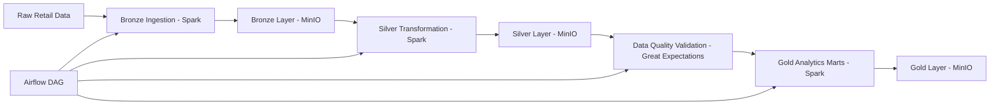

# Fashion Data Platform

A local **lakehouse-style analytics platform** built with **Spark, Airflow, and MinIO**.

This project demonstrates a complete modern data pipeline that ingests raw retail data, processes it through layered transformations, validates data quality, and produces business-ready analytics tables.

---

# Architecture

The platform follows a **lakehouse data architecture**:

```
Raw → Bronze → Silver → Gold
```

- **Raw** — source-of-truth data
- **Bronze** — structured ingestion layer
- **Silver** — cleaned transactional data
- **Gold** — analytics-ready datasets

---

# Data Pipeline



Airflow orchestrates the pipeline and Spark performs the data transformations.

---

# Tech Stack

| Component | Purpose |
|-----------|---------|
| Docker Compose | Local platform orchestration |
| Apache Spark | Data processing |
| Apache Airflow | Pipeline orchestration |
| MinIO | S3-compatible object storage |
| PostgreSQL | Airflow metadata database |
| Great Expectations | Data quality validation |
| Pytest | Automated tests |
| GitHub Actions | Continuous integration |

---

# Repository Structure

```text
fashion-data-platform/

airflow/
  dags/
    silver_online_retail_dag.py

config/
  dev.yml

spark/
  jobs/
    bronze_ingest.py
    silver_transform.py
    validate_silver_ge.py
    gold_marts.py

    lib/
      silver_online_retail.py
      gold_online_retail.py

  tests/
    test_customer_rfm.py
    test_silver_online_retail.py

great_expectations/
  expectations/
    silver_online_retail.json

.github/
  workflows/
    ci.yml

docker-compose.yml
README.md
```

---

# Running the Platform

Start all services:

```bash
docker compose up -d
```

Check running containers:

```bash
docker compose ps
```

Stop the platform:

```bash
docker compose down
```

---

# Platform Interfaces

| Service | URL |
|---------|-----|
| Airflow UI | http://localhost:8080 |
| Spark Master UI | http://localhost:8081 |
| MinIO Console | http://localhost:9001 |

---

# Running Spark Jobs

Example: Bronze ingestion

```bash
docker compose exec spark-master spark-submit \
  /opt/spark/work-dir/spark/jobs/bronze_ingest.py \
  --config /opt/spark/work-dir/config/dev.yml \
  --date 2024-01-01
```

Example: Silver transformation

```bash
docker compose exec spark-master spark-submit \
  /opt/spark/work-dir/spark/jobs/silver_transform.py \
  --config /opt/spark/work-dir/config/dev.yml \
  --date 2024-01-01
```

Example: Gold marts

```bash
docker compose exec spark-master spark-submit \
  /opt/spark/work-dir/spark/jobs/gold_marts.py \
  --config /opt/spark/work-dir/config/dev.yml \
  --date 2024-01-01
```

---

# Running Tests

Tests are executed inside the Spark container.

```bash
docker compose exec \
  -e PYTHONPATH=/opt/spark/work-dir:/opt/spark/work-dir/spark \
  spark-master pytest /opt/spark/tests -q
```

Expected output:

```text
4 passed
```

---

# Airflow Pipeline

Pipeline order:

```text
bronze_ingest
→ silver_transform
→ validate_silver
→ gold_marts
```

DAG location:

```text
airflow/dags/silver_online_retail_dag.py
```

---

# Continuous Integration

CI is implemented using **GitHub Actions**.

Workflow file:

```text
.github/workflows/ci.yml
```

Tests run automatically on:

- push to main
- push to feature branches
- pull requests

---

# Author

**Behzad Moloudi**

Master’s — Interactive Technologies & AI

Focus areas demonstrated:

- Data Engineering
- Spark Processing
- Airflow Orchestration
- Lakehouse Architecture
- Analytics Engineering
```